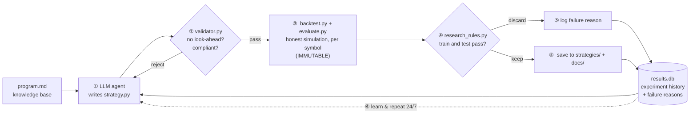
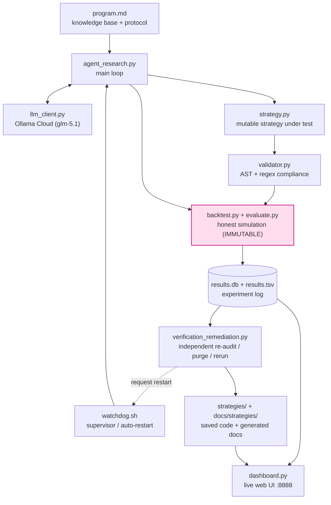
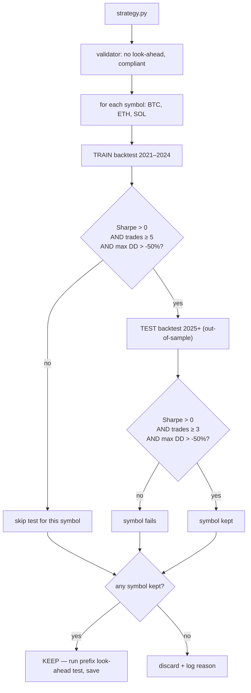

# LLM Trading Auto-Research

[](https://github.com/nhocconan/trading-llm-auto-research/actions/workflows/ci.yml)
[](LICENSE)

**Autonomous trading strategy discovery system** powered by LLM agents. Inspired by [Karpathy's autoresearch](https://github.com/karpathy/autoresearch) — but for crypto futures trading.

> **CI / honest-simulation guarantee:** every push runs a [test suite](tests/) that proves the backtest engine cannot look ahead, applies the documented round-trip cost, and computes metrics correctly — all on synthetic data, so it is fully reproducible without any market-data download.

## What Makes This Different

This is NOT a collection of Python trading scripts. The core innovation is:

1. **An LLM agent writes the strategies** — It reads a [knowledge base](program.md) of real quantitative trading techniques, writes `strategy.py`, and submits it for testing.
2. **Automated evaluation loop** — Each strategy is backtested on 4 years of data across 3 crypto assets, with realistic costs. The loop runs 24/7 without human intervention.
3. **Ratcheting improvement** — Only strategies that pass the repo's per-symbol train/test rules are kept. Bad strategies are automatically discarded and the agent learns from failures.
4. **Honest simulation** — No cheating. Strict no-lookahead enforcement, realistic fees (0.10% round trip), funding rates, and fill delays. A [compliance validator](validator.py) checks every strategy, and an independent verifier re-audits saved strategies. See [Backtesting Rules](docs/backtesting-rules.md) and [Autoresearch Operations](docs/autoresearch-operations.md).

The result: hundreds of experiments tested automatically, with the system progressively discovering better strategies through structured exploration of trend following, mean reversion, momentum, multi-timeframe analysis, and ensemble approaches.

## How the AI/LLM is Used

| Component | Role of AI | Why AI, not manual? |
|-----------|-----------|---------------------|
| **Strategy generation** | LLM writes complete `strategy.py` with entry/exit logic, indicator calculations, position sizing | Explores thousands of indicator combinations faster than a human quant |
| **Hypothesis formation** | LLM reads past experiment results and proposes what to try next | Systematic exploration — doesn't repeat failed approaches, follows a [phased research plan](program.md) |
| **Code generation** | LLM produces valid, vectorized numpy/pandas code with proper `min_periods` and no lookahead | Eliminates manual coding bottleneck — one strategy per minute |
| **Learning from failure** | Failed experiments (with reasons) are fed back to the LLM on each iteration | The agent avoids repeating mistakes and adapts its approach |

The AI does NOT:
- Modify the backtest engine (immutable)
- Evaluate its own results (metrics are computed by fixed code)
- Access test period data during optimization
- Skip cost calculations

## The Autoresearch Loop

The system is a direct adaptation of [Karpathy's autoresearch](https://github.com/karpathy/autoresearch) idea — *an LLM that runs its own research program* — to quantitative trading. Karpathy's loop is **hypothesize → implement → measure → keep what works → learn → repeat**. Here, a "paper" is a trading strategy, the "experiment" is an honest backtest, and the "reviewer" is a fixed evaluation harness the model is not allowed to touch.



| Karpathy autoresearch | This project |
|-----------------------|--------------|
| LLM proposes a research idea | LLM proposes a strategy hypothesis from `program.md` |
| Writes code for the experiment | Writes `strategy.py` (vectorized numpy/pandas) |
| Runs the experiment | Honest backtest on 4y × 3 assets with real costs & funding |
| Fixed, un-gameable evaluation | `backtest.py` + `evaluate.py` + `research_rules.py` are **immutable** |
| Keep results that advance the frontier | Keep only strategies passing per-symbol train **and** test |
| Feed outcomes back into the next idea | Failures + reasons are fed to the next generation |
| Run continuously | `watchdog.sh` keeps the loop alive 24/7 |

The crucial discipline borrowed from autoresearch: **the researcher cannot grade its own homework.** The LLM writes strategies but never touches the engine, the metrics, or the test-period data — so a "discovery" is only as real as an out-of-sample, cost-aware, look-ahead-free backtest says it is.

## Architecture



The pink node is **immutable** — the agent cannot modify the simulation that judges it. See [Architecture Details](docs/architecture.md) for the full breakdown, [Karpathy Alignment](docs/karpathy-autoresearch-alignment.md) for the deeper mapping, and [Autoresearch Operations](docs/autoresearch-operations.md) for restart/remediation behavior.

## How Strategies Are Evaluated (per-symbol gate)

A strategy is kept if it works on **any one** of BTC/ETH/SOL — each symbol is judged independently, because the three assets have genuinely different market characteristics. Test runs only for symbols whose own train pass already succeeded.



Thresholds live in one place — [`research_rules.py`](research_rules.py) — so the rules above can never drift from what the code enforces. **0-trade strategies are always discarded.**

## Quick Start

```bash
# 1. Setup
python3 -m venv .venv && source .venv/bin/activate
pip install -r requirements.txt
cp .env.example .env  # Add your LLM API key

# Primary: official Ollama Cloud
# Set OLLAMA_API_KEY in .env
#
# Optional: local Ollama override
# curl -fsSL https://ollama.com/install.sh | sh
# ollama pull gemma4:e2b
# export OLLAMA_BASE_URL=http://127.0.0.1:11434/api/chat
# export OLLAMA_MODEL=gemma4:e2b

# 2. Download data (Binance historical, ~571MB)
python prepare.py

# 3. Run everything (data + dashboard + research loop)
./run.sh --all

# Or step by step:
./run.sh --prepare     # Download data
./run.sh --dashboard   # Start dashboard at http://localhost:8888
./run.sh               # Start research loop (runs forever)
./run.sh --status      # Check progress
./run.sh --stop        # Stop everything
```

## Dashboard

Live at `http://localhost:8888` (auto-refresh every 10 minutes).

**Features:**
- Train/Test period split with stats
- Filter & sort by symbol (BTCUSDT / ETHUSDT / SOLUSDT / Avg All)
- Click any strategy → **Detail Modal**:
  - Full metrics per symbol (Sharpe, Sortino, Calmar, CAGR, DD, Win Rate, PF)
  - Compliance check (lookahead, leverage, timeframe validation)
  - Strategy source code
  - **"View Detail" per symbol** → Price chart with:
    - Close price + EMA(21) + EMA(55) indicator overlays
    - Entry markers (green=long, red=short) and exit markers
    - Signal strength bar chart
    - Equity curve
    - Full trade-by-trade history with PnL, fees, funding

## Operational Safeguards

- `watchdog.sh` now restarts the research loop when core files change, the process gets stuck, or remediation requests a restart.
- `agent_research.py` persists experiment state in `logs/agent_research_state.json`, so a restart resumes from the correct experiment number instead of going back to the beginning.
- `auto_concept_research.sh` runs concept discovery and `verification_remediation.py` in the same scheduled job.
- `verification_remediation.py` audits recent strategies, removes invalid stored results, reruns repaired strategies, and asks the watchdog to restart autoresearch when patched logic must become live.

See [Autoresearch Operations](docs/autoresearch-operations.md) for the full operational flow.

## Key Rules

All rules are enforced automatically. See [Backtesting Rules](docs/backtesting-rules.md) for details.

| Rule | How Enforced |
|------|-------------|
| No lookahead | Engine shifts signals by 1 bar; validators reject `.shift(-n)`, `np.roll(..., -n)`, future indexing, and whole-prefix instability |
| Fill at t+1 open | Engine applies `fill_delay_bars=1` |
| Realistic costs | 0.04% fee + 0.01% slippage per side, funding every 8h |
| Max drawdown -50% | Enforced per symbol on both train and test |
| Trade minimums | Train: ≥ 5 per symbol, Test: ≥ 3 per symbol |
| Position sizing ≤ 0.40 | System prompt enforces max signal magnitude |
| Train/test separation | Train: 2021-2024, Test: 2025+. Never optimize on test. |
| 1m timeframe banned | Too noisy — validator rejects it |
| Test gating | A symbol runs test only if its own train pass succeeded |

## Data

| Symbol | Source | Timeframes | Train Period | Test Period |
|--------|--------|-----------|-------------|------------|
| BTCUSDT | Binance Futures | 5m, 15m, 1h, 4h, 1d | 2021-01-01 to 2024-12-31 | 2025-01-01+ |
| ETHUSDT | Binance Futures | 5m, 15m, 1h, 4h, 1d | 2021-01-01 to 2024-12-31 | 2025-01-01+ |
| SOLUSDT | Binance Futures | 5m, 15m, 1h, 4h, 1d | 2021-01-01 to 2024-12-31 | 2025-01-01+ |

Data is downloaded from [Binance Public Data](https://data.binance.vision/) via `prepare.py` and stored as Parquet files in `data/processed/`. Funding rate data is also included.

> **Optional — live market data (MCP).** You can connect the [Financial Datasets MCP](https://docs.financialdatasets.ai/mcp-server#claude-code) to Claude Code for *live* crypto/equity prices and fundamentals — handy for forward context and ad-hoc analysis. It is **strictly outside the backtest**: the reproducible research loop stays on offline Binance parquet, and live data must never reach `strategy.py`, the engine, or train/test data (it would break no-look-ahead and reproducibility). See [Live Market Data via MCP](docs/live-data-mcp-integration.md).

## Strategy Knowledge Base

The LLM agent has access to a [comprehensive compendium](docs/strategies/strategy_research_compendium.md) of real quantitative trading strategies, organized into:

- **Trend Following**: Supertrend, HMA, KAMA, Donchian, DEMA
- **Mean Reversion**: Bollinger-Keltner Squeeze, RSI extremes, Z-score
- **Momentum**: MACD histogram, ROC+RSI, Stochastic Momentum Index
- **Volume**: OBV divergence, volume-weighted breakout
- **Multi-Timeframe**: 4H trend + 1H entry (proven to 2x Sharpe)
- **Regime Detection**: Volatility-based strategy selection
- **Risk Management**: ATR stops, Kelly criterion, position sizing

See [program.md](program.md) for the full research protocol and experiment phases.

## Project Structure

```
├── README.md              ← You are here
├── CLAUDE.md              ← Rules for the AI agent
├── program.md             ← Research protocol & knowledge base
├── config.yaml            ← Configuration (symbols, dates, costs)
├── .env                   ← API keys (not in git)
├── .env.example           ← API key template
├── run.sh                 ← Convenience runner script
├── watchdog.sh            ← Keeps autoresearch running and restarts on fixes
├── auto_concept_research.sh ← Scheduled concept discovery + verification remediation
│
├── prepare.py             ← [IMMUTABLE] Data download & processing
├── backtest.py            ← [IMMUTABLE] Backtesting engine
├── evaluate.py            ← [IMMUTABLE] Performance metrics
├── strategy.py            ← [MUTABLE] Current strategy under test
├── agent_research.py      ← Main research loop (LLM agent)
├── verification_remediation.py ← Independent verification, purge, rerun
├── llm_client.py          ← Multi-provider LLM client
├── dashboard.py           ← Web dashboard with charts
├── validator.py           ← Strategy compliance checker
│
├── results.db             ← Primary experiment/result database
├── results.tsv            ← Legacy result mirror for compatibility
├── strategies/            ← Saved strategy code (at least one symbol passed both train and test)
├── docs/                  ← Documentation
│   ├── architecture.md
│   ├── autoresearch-operations.md
│   ├── backtesting-rules.md
│   └── strategies/        ← Per-strategy docs + research compendium
├── data/                  ← Market data (not in git, download with prepare.py)
│   └── processed/
│       ├── klines/        ← OHLCV Parquet files
│       └── funding/       ← Funding rate data
└── requirements.txt
```

## LLM Providers

Primary setup uses official Ollama for both cloud and local execution. Configure in `.env`:

```bash
# Official Ollama Cloud
OLLAMA_API_KEY=your-key
OLLAMA_BASE_URL=https://ollama.com/api/chat
OLLAMA_MODEL=glm-5.1:cloud
OLLAMA_ANALYSIS_MODEL=glm-5.1:cloud

# Optional local override
# OLLAMA_BASE_URL=http://127.0.0.1:11434/api/chat
# OLLAMA_MODEL=gemma4:e2b
```

Recommended cloud models for this repo from current benchmarks:
- `glm-5.1:cloud`: required model for auto-research generation and analysis
- `qwen3-coder-next`: slower but coding-focused fallback
- `gemma3:27b`: working Google-family fallback on cloud

`gemma4` is currently a local Ollama option here. The Ollama Cloud API did not expose it in our tests, even though the local library page exists.

Suggested model split:
- `OLLAMA_MODEL=glm-5.1:cloud` for `agent_research.py`
- `OLLAMA_ANALYSIS_MODEL=glm-5.1:cloud` for `auto_concept_research.py` and `auto_process_review.py`
- Optional `OLLAMA_CONVERT_MODEL=qwen3-coder-next` for Pine-to-Python conversion tools

## Testing & CI

The engine's promise is *honest simulation* — so that promise is locked in by an
automated [test suite](tests/) that runs on every push via [GitHub Actions](.github/workflows/ci.yml).

```bash
pip install -r requirements-ci.txt
pytest                      # 47 tests, runs in < 1s, no market data needed
ruff check tests/ scripts/  # lint
python validator.py strategy.py            # compliance self-check
python scripts/check_results_integrity.py  # no duplicate result rows
```

Every test is built from **synthetic OHLCV data**, so the suite is fully
reproducible in CI without downloading any Binance data. It proves, among other
things, that a signal at bar *t* can only fill at *t+1* (no look-ahead), that
higher-timeframe values are invisible until their candle closes, that the
documented round-trip cost is actually charged, and that funding is signed by
position direction. See [tests/README.md](tests/README.md) for the full map and
[CHANGELOG.md](CHANGELOG.md) for the engine-correctness history.

## Contributing

Contributions are welcome — new strategy ideas for `program.md`, engine/test
improvements, docs, or tooling. Start with **[CONTRIBUTING.md](CONTRIBUTING.md)**,
which explains the repo's one rule that matters most: *the agent (and you) cannot
make the evaluation easier on itself.* The backtest engine, metrics, and rules
are immutable; if you change engine behaviour, add a test that proves the new
guarantee first.

## License

MIT
