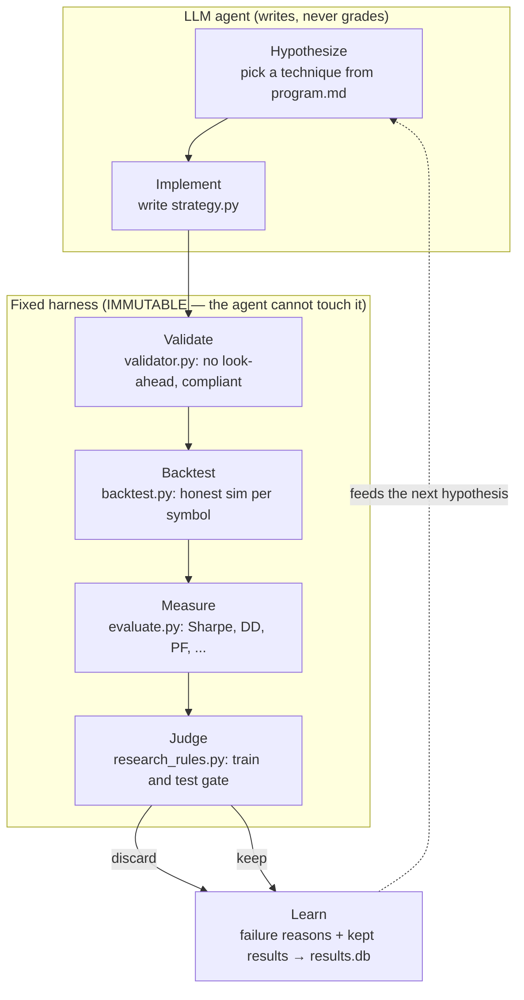

# Karpathy Autoresearch Alignment

This project is a deliberate adaptation of the **autoresearch** idea popularised
by [Andrej Karpathy](https://github.com/karpathy/autoresearch): give an LLM a
research *program* and let it run the loop of proposing, implementing, measuring,
and learning — autonomously, around the clock. Here the research domain is
quantitative trading of BTC/ETH/SOL USDT-M perpetual futures.

## The loop

## Why the separation matters

The single most important property — borrowed straight from autoresearch — is
that **the researcher cannot grade its own homework**:

- The LLM **writes** `strategy.py`.
- The LLM **never** modifies `backtest.py`, `evaluate.py`, or `research_rules.py`.
- The LLM **never** sees test-period data while optimizing.

Without this separation, an autonomous optimizer trivially "discovers" look-ahead
bias, overfits the test set, or quietly drops trading costs — and reports
spectacular fake returns. The immutable harness is what makes a discovery
*trustworthy*.

## Mapping table

| Autoresearch concept | Implementation here | File |
|----------------------|---------------------|------|
| Research program / prior literature | Strategy knowledge base & phased protocol | [`program.md`](../program.md) |
| Idea generation | LLM hypothesis from knowledge base + history | [`agent_research.py`](../agent_research.py) |
| Experiment code | Generated `strategy.py` | [`strategy.py`](../strategy.py) |
| Reproducibility / fraud guard | Static compliance + prefix look-ahead test | [`validator.py`](../validator.py) |
| The experiment | Honest backtest (costs, funding, t+1 fills) | [`backtest.py`](../backtest.py) |
| Measurement | Performance metrics | [`evaluate.py`](../evaluate.py) |
| Peer review / accept criteria | Per-symbol train **and** test gate | [`research_rules.py`](../research_rules.py) |
| Lab notebook | Append-only experiment log | `results.db` / `results.tsv` |
| Replication / retraction | Independent re-audit, purge, rerun | [`verification_remediation.py`](../verification_remediation.py) |
| Running the lab 24/7 | Supervisor with auto-restart | [`watchdog.sh`](../watchdog.sh) |
| Continuous self-improvement | Concept discovery + review cadence | [`auto_concept_research.sh`](../auto_concept_research.sh) |

## What "honest simulation" buys us

Every experiment is run under conditions designed to make cheating impossible and
results conservative:

- **No look-ahead** — signals are shifted one bar by the engine; the validator
  rejects future indexing; a prefix test recomputes signals on growing data
  slices and requires them to be stable.
- **Real higher-timeframe data** — never resampled; HTF values are only visible
  after their candle closes ([`mtf_data.py`](../mtf_data.py)).
- **Realistic costs** — 0.10% round trip + 8-hourly funding (signed by position
  direction).
- **Strict train/test split** — train 2021–2024, test 2025+; the test set is
  never used during optimization.

These guarantees are not just documented — they are pinned by the
[test suite](../tests/), so they cannot silently regress.

## Differences from the original autoresearch

- **Domain**: trading strategies instead of ML papers/experiments.
- **Per-asset acceptance**: a result is kept if it generalizes to *any one* of
  three assets, reflecting that BTC, ETH, and SOL are different markets.
- **Adversarial evaluation**: because money is on the line, the harness is
  unusually strict about look-ahead and cost realism, and a separate
  verification pass can retroactively purge results that fail re-audit.
